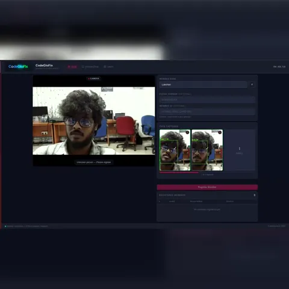
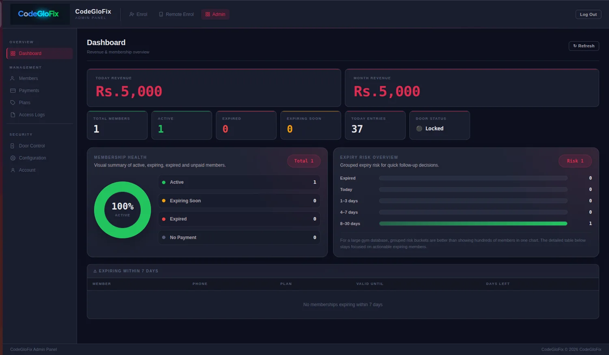
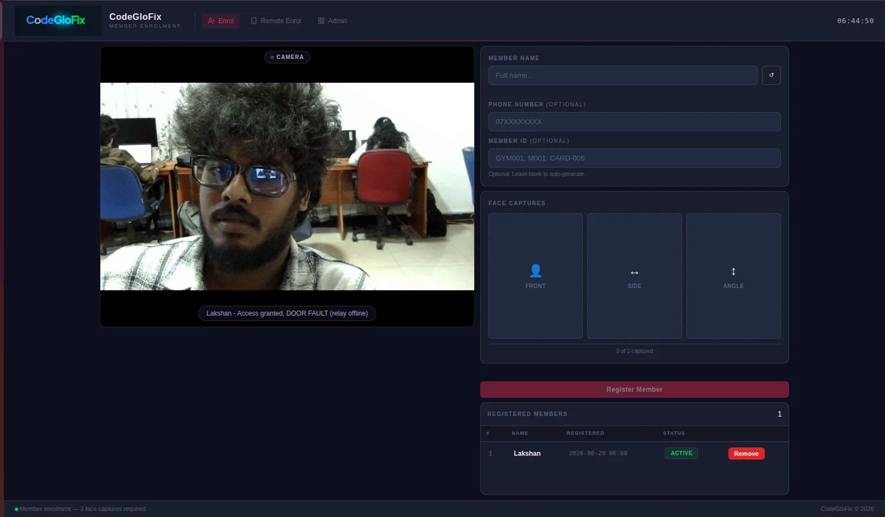
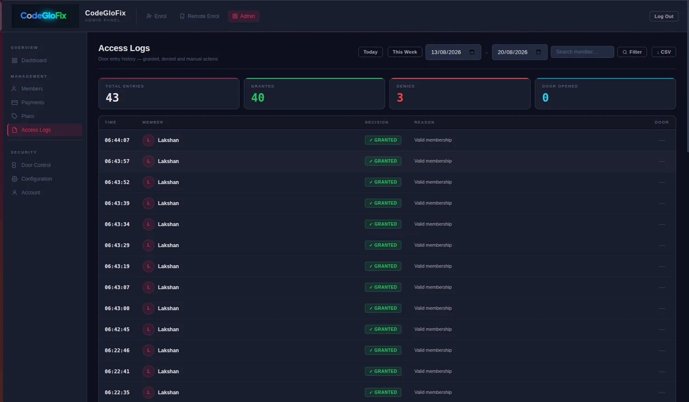
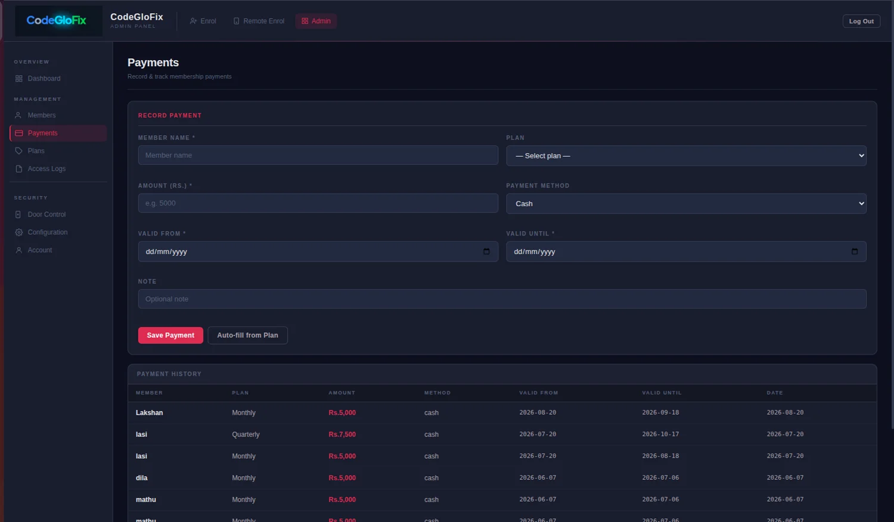
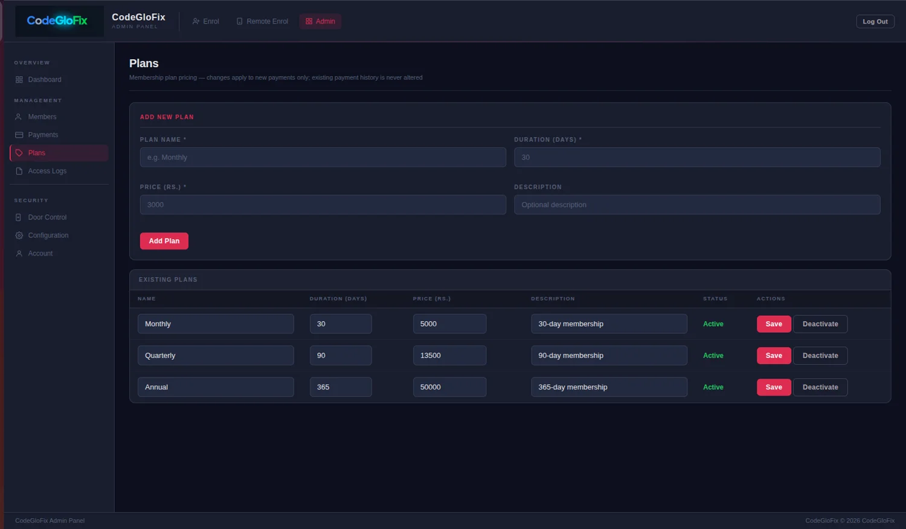
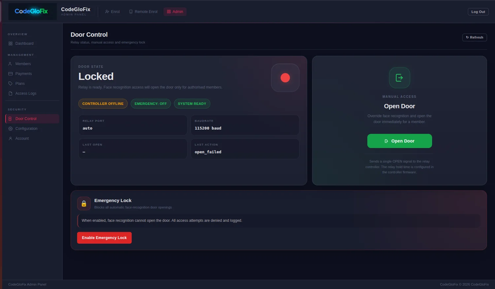

# CodeGloFix Gym Access Control

Face-recognition access control for gyms. A camera at the entrance identifies
enrolled members with InsightFace (ArcFace embeddings), checks their membership /
payment status, and opens a magnetic door lock through a USB-serial relay
controller. An admin web panel manages members, payments, plans, access logs and
door control.

## Features

- Real-time face recognition (InsightFace + ONNX Runtime + OpenCV)
- Membership-aware access decisions: granted / denied / expiring-soon
- USB serial relay control for the door (auto-discovery, mock mode when offline)
- Admin panel: dashboard & revenue, members, payments, plans, access logs,
  door control, gate configuration
- Member enrolment (3 face captures) locally or via remote enrolment page
- MJPEG live stream + optional PyQt6 fullscreen live display for a 7" kiosk
- Production tooling: systemd services, nginx TLS reverse proxy, backups,
  health checks, log rotation, data export/import

## Demo

[](docs/images/face-recognition-demo.mp4)

▶️ **[Watch the face-recognition demo (MP4, 43 s)](docs/images/face-recognition-demo.mp4)**. It shows member
enrolment with multi-angle face captures, the live gate view with on-screen positioning guidance, and
on-site testing with the entrance display mounted at a real gym door.

## Screenshots

| Admin dashboard | Member enrolment |
|---|---|
|  |  |
| **Access logs** | **Payments** |
|  |  |
| **Membership plans** | **Door control** |
|  |  |

## Tech stack

Python 3.10–3.12 · FastAPI · Uvicorn · Jinja2 · OpenCV · InsightFace ·
ONNX Runtime · SQLite · pyserial · (optional) PyQt6

## Project layout

| Path | Purpose |
|---|---|
| `main.py` | FastAPI app, camera loop, API routes, streaming |
| `identity_engine.py`, `face_gate.py` | Face detection / recognition and gate logic |
| `gym_access.py`, `gym_db.py` | Access decisions and SQLite data layer |
| `relay_controller.py` | Serial door relay controller |
| `auth.py` | Admin session authentication |
| `templates/`, `static/` | Web UI (admin, enrol, live view) |
| `kiosk/` | PyQt6 live display + desktop launchers |
| `deploy/` | Production installer, systemd units, env template |
| `tools/` | Hardware check, pre-install audit, soak test |
| `docs/` | Installation guide and migration notes |

## Quick start (development)

```bash
sudo apt install -y python3 python3-pip python3-venv git curl speech-dispatcher
python3 -m venv ../venv
../venv/bin/pip install --upgrade pip
../venv/bin/pip install -r requirements.txt
# optional PyQt live display:
../venv/bin/pip install -r requirements-display.txt

export ADMIN_PASSWORD='choose-a-password'
export SESSION_SECRET="$(python3 -c 'import secrets; print(secrets.token_hex(32))')"
export COOKIE_SECURE=false      # true only behind HTTPS
export VIDEO_SOURCE=0           # webcam index, /dev/videoN, rtsp://…, a .mp4, or "none"
./start.sh
```

Then open `http://127.0.0.1:5000/`. The admin panel is at `/admin`, and
enrolment is at `/enrol`.

The SQLite database (`gym.db`) and face embeddings (`enrolments/`) are created at
runtime. They hold personal and biometric data and are git-ignored on purpose.

## Configuration

- **Environment**: see `deploy/codeglofix-access.env.template` for every option
  (secrets, data paths, camera, relay port and baud rate, stream tuning).
- **Gate behaviour**: `gate_config.json` (minimum face size, ROI, cooldown,
  relay settings, expiry warning days, emergency lock).

## Production install

For a customer PC on Ubuntu 22.04 or 24.04, follow
[`deploy/CUSTOMER_INSTALL_GUIDE.md`](deploy/CUSTOMER_INSTALL_GUIDE.md) and
[`docs/final-installation-guide/`](docs/final-installation-guide/). In short:

```bash
./tools/preinstall_audit.sh
sudo ./deploy/install_customer_pc.sh
```

The app binds to `127.0.0.1:5000` only. nginx (`gym-access.nginx`) handles
HTTPS termination.

## Privacy

This system processes biometric data. Never commit `gym.db`, `enrolments/`,
`*.npz`, logs, or real `.env` files. Get member consent and follow your local
data-protection law (such as GDPR or Sri Lanka's PDPA) when you deploy.
